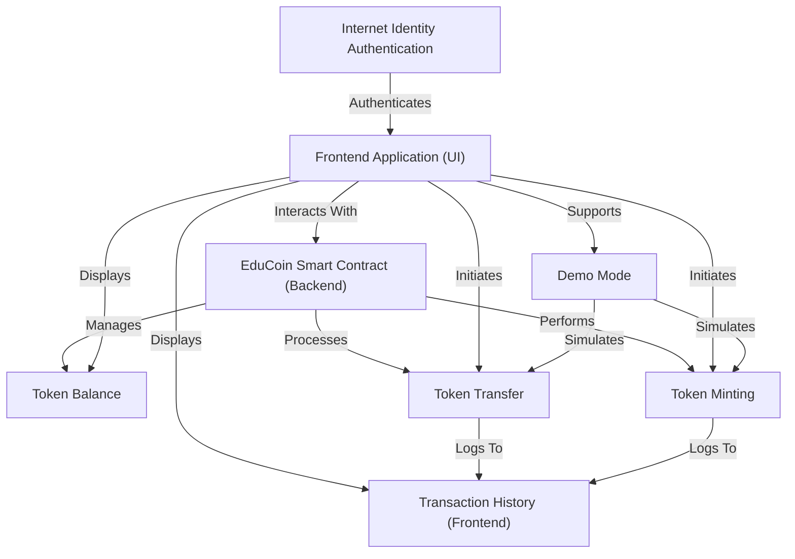

# EduCoin - ICP Educational Token Platform


EduCoin is an *educational cryptocurrency platform* built on the **Internet Computer Protocol (ICP)**, designed to help students learn blockchain. It features a robust **smart contract backend** that securely manages digital tokens, allowing users to view their *token balances*, perform *token transfers*, and in a controlled manner, *mint new tokens*. A user-friendly **React frontend** provides an interface for these operations, including a convenient *demo mode* for trying out features without blockchain connection, and displays a local *transaction history* of recent activities, all secured by **Internet Identity authentication** for real blockchain interaction.


## Visual Overview



## Chapters

1. [Frontend Application (UI)
](01_frontend_application__ui__.md)
2. [Internet Identity Authentication
](02_internet_identity_authentication_.md)
3. [Token Balance
](03_token_balance_.md)
4. [Token Transfer
](04_token_transfer_.md)
5. [Token Minting
](05_token_minting_.md)
6. [Demo Mode
](06_demo_mode_.md)
7. [Transaction History (Frontend)
](07_transaction_history__frontend__.md)
8. [EduCoin Smart Contract (Backend)
](08_educoin_smart_contract__backend__.md)

---


An educational cryptocurrency platform built on Internet Computer Protocol (ICP) to help students learn blockchain technology.

## 🏗️ Project Structure

```
edu_coin/
├── dfx.json                 # DFX configuration
├── src/
│   └── edu_coin_backend/    # Motoko canister
│       └── main.mo          # Token contract logic
├── frontend/                # React frontend
│   ├── src/
│   │   ├── App.js          # Main React component
│   │   └── App.css         # Styles
│   └── package.json        # Frontend dependencies
└── README.md               # This file
```

## 🚀 Quick Start

### Prerequisites

1. **Install DFX SDK** (Windows users may need WSL)
   ```bash
   sh -ci "$(curl -fsSL https://internetcomputer.org/install.sh)"
   ```

2. **Install Node.js** (for frontend)
   - Download from [nodejs.org](https://nodejs.org/)

### Setup & Development

1. **Clone and setup**
   ```bash
   git clone <your-repo>
   cd edu_coin
   ```

2. **Install frontend dependencies**
   ```bash
   cd frontend
   npm install
   cd ..
   ```

3. **Start local ICP replica** (if DFX is installed)
   ```bash
   dfx start --background
   ```

4. **Deploy canisters** (if DFX is installed)
   ```bash
   dfx deploy
   ```

5. **Start frontend**
   ```bash
   cd frontend
   npm start
   ```

## 🎮 Demo Mode

The app runs in demo mode by default, allowing you to:
- Test token transfers
- Mint new tokens
- View transaction history
- Experience the UI without blockchain connection

## 🔐 ICP Integration

When connected to ICP:
- Uses Internet Identity for authentication
- Interacts with Motoko canister for token operations
- Stores data on-chain
- Provides real blockchain functionality

## 📚 Learning Objectives

This project teaches:
- **Blockchain Basics**: Understanding tokens and transactions
- **ICP Development**: Motoko canisters and Internet Identity
- **React Integration**: Connecting frontend to blockchain
- **Web3 UX**: Wallet connections and transaction flows

## 🛠️ Technology Stack

**Backend:**
- Motoko (ICP canister language)
- Internet Computer Protocol
- Internet Identity

**Frontend:**
- React.js
- Dfinity Agent
- CSS3

## 📖 Features

- ✅ Token balance display
- ✅ Token transfers
- ✅ Token minting
- ✅ Transaction history
- ✅ Internet Identity auth
- ✅ Demo mode
- ✅ Responsive UI

## 🎯 Next Steps

- [ ] Add more token functionality
- [ ] Implement token standards
- [ ] Add governance features
- [ ] Create educational content
- [ ] Deploy to mainnet

## 📄 License

This project is for educational purposes.
