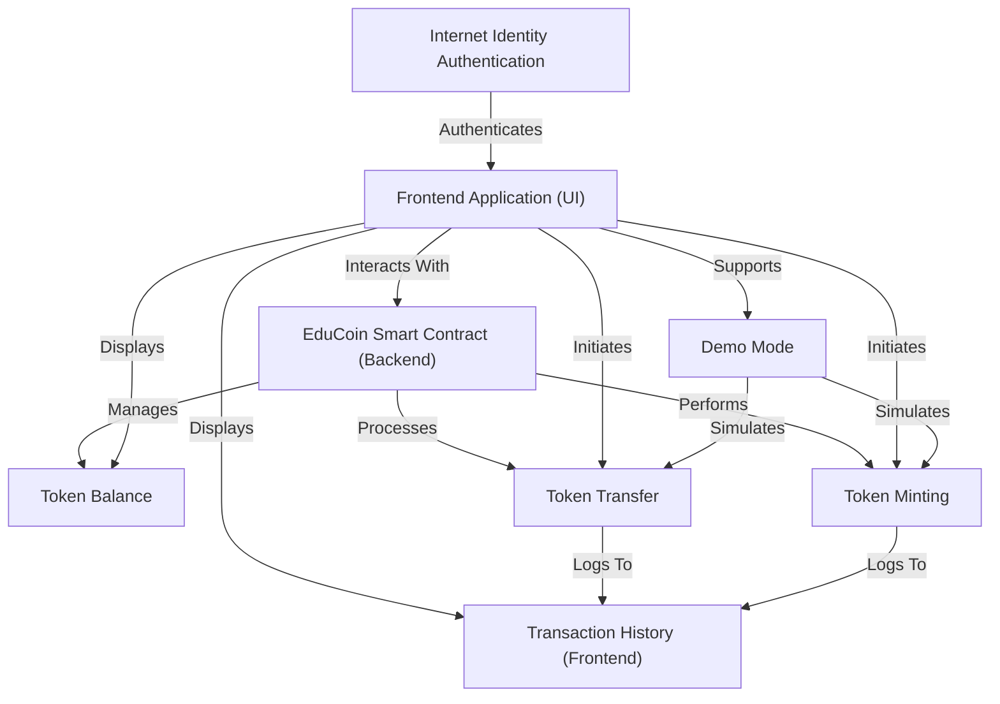
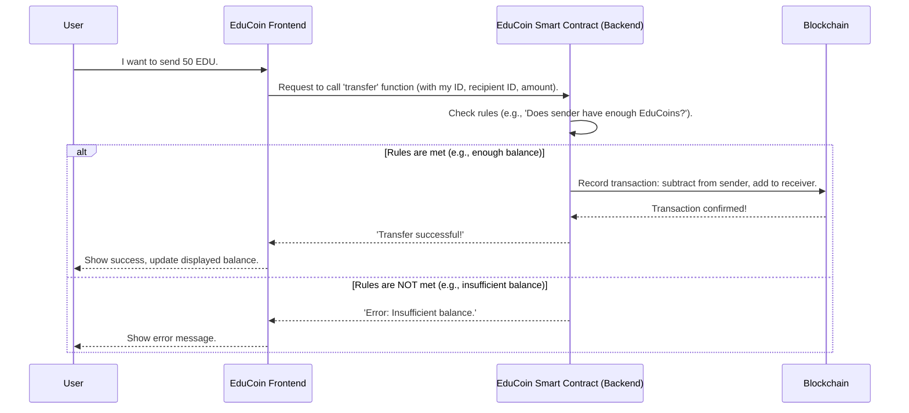

# EduCoin - ICP Educational Token Platform


EduCoin is an *educational cryptocurrency platform* built on the **Internet Computer Protocol (ICP)**, designed to help students learn blockchain. It features a robust **smart contract backend** that securely manages digital tokens, allowing users to view their *token balances*, perform *token transfers*, and in a controlled manner, *mint new tokens*. A user-friendly **React frontend** provides an interface for these operations, including a convenient *demo mode* for trying out features without blockchain connection, and displays a local *transaction history* of recent activities, all secured by **Internet Identity authentication** for real blockchain interaction.


## Visual Overview




An educational cryptocurrency platform built on Internet Computer Protocol (ICP) to help students learn blockchain technology.

## 🏗️ Project Structure

```
edu_coin/
├── dfx.json                 # DFX configuration
├── src/
│   └── edu_coin_backend/    # Motoko canister
│       └── main.mo          # Token contract logic
├── frontend/                # React frontend
│   ├── src/
│   │   ├── App.js          # Main React component
│   │   └── App.css         # Styles
│   └── package.json        # Frontend dependencies
└── README.md               # This file
```

## 🚀 Quick Start

### Prerequisites

1. **Install DFX SDK** (Windows users may need WSL)
   ```bash
   sh -ci "$(curl -fsSL https://internetcomputer.org/install.sh)"
   ```

2. **Install Node.js** (for frontend)
   - Download from [nodejs.org](https://nodejs.org/)

### Setup & Development

1. **Clone and setup**
   ```bash
   git clone <your-repo>
   cd edu_coin
   ```

2. **Install frontend dependencies**
   ```bash
   cd frontend
   npm install
   cd ..
   ```

3. **Start local ICP replica** (if DFX is installed)
   ```bash
   dfx start --background
   ```

4. **Deploy canisters** (if DFX is installed)
   ```bash
   dfx deploy
   ```

5. **Start frontend**
   ```bash
   cd frontend
   npm start
   ```

## 🎮 Demo Mode

The app runs in demo mode by default, allowing you to:
- Test token transfers
- Mint new tokens
- View transaction history
- Experience the UI without blockchain connection

## 🔐 ICP Integration

When connected to ICP:
- Uses Internet Identity for authentication
- Interacts with Motoko canister for token operations
- Stores data on-chain
- Provides real blockchain functionality

## 📚 Learning Objectives

This project teaches:
- **Blockchain Basics**: Understanding tokens and transactions
- **ICP Development**: Motoko canisters and Internet Identity
- **React Integration**: Connecting frontend to blockchain
- **Web3 UX**: Wallet connections and transaction flows

## 🛠️ Technology Stack

**Backend:**
- Motoko (ICP canister language)
- Internet Computer Protocol
- Internet Identity

**Frontend:**
- React.js
- Dfinity Agent
- CSS3

## 📖 Features

- ✅ Token balance display
- ✅ Token transfers
- ✅ Token minting
- ✅ Transaction history
- ✅ Internet Identity auth
- ✅ Demo mode
- ✅ Responsive UI

## 🎯 Next Steps

- [ ] Add more token functionality
- [ ] Implement token standards
- [ ] Add governance features
- [ ] Create educational content
- [ ] Deploy to mainnet

## What is the EduCoin Smart Contract (Backend)?

The **EduCoin Smart Contract** is the "brain" or "engine" of the entire EduCoin system. It's not just a piece of software on a normal computer; it's a special kind of program written in **Rust** (a powerful programming language) that lives on a **blockchain** (like the NEAR Protocol in our case).

Think of it as:

*   **An Unchangeable Digital Rulebook:** Once deployed on the blockchain, its rules cannot be changed or tampered with. This means everyone knows exactly how EduCoin works, and nobody can cheat.
*   **A Super Secure Accountant:** It keeps track of every single EduCoin in existence, who owns them, and every transfer that happens. It does this automatically and perfectly, without needing a human to oversee it.
*   **Living on the Blockchain:** This is key! Because it's on a blockchain, it's decentralized (not controlled by one company), transparent (everyone can see the rules and transactions), and incredibly secure.
*   **Governs All Token Operations:** Every time you want to check a balance, send tokens, or (if you're the owner) mint new ones, your frontend application sends a request to this Smart Contract. It then processes the request according to its unchangeable rules.

## How the Smart Contract Connects to What You've Learned

Let's quickly see how this backend "brain" makes all the frontend features possible:

*   **[Token Balance](03_token_balance_.md):** When you see your balance, the frontend asks the Smart Contract for the official number stored on the blockchain.
*   **[Token Transfer](04_token_transfer_.md):** When you send EduCoins, the frontend tells the Smart Contract to execute the transfer. The contract verifies you have enough funds and then updates the official balances.
*   **[Token Minting](05_token_minting_.md):** When new EduCoins are created, the frontend requests the Smart Contract (as the owner) to perform the minting, which then increases the total supply and the recipient's balance.
*   **[Internet Identity Authentication](02_internet_identity_authentication_.md):** Your Internet Identity provides the secure "signature" that proves to the Smart Contract that it's *you* making the request (e.g., sending *your* tokens).
*   **[Transaction History (Frontend)](07_transaction_history__frontend__.md):** While our demo history is local, in a real scenario, the Smart Contract itself would be the source of a permanent, verifiable transaction history on the blockchain.

## Under the Hood: The Smart Contract as a Robot Accountant

Imagine a super-efficient, super-trustworthy robot accountant sitting in a glass box in the middle of a town square. Everyone can see the robot, and everyone knows its programming rules. You give it a request, it performs the action perfectly according to its rules, and everyone can see the result. That's a bit like our Smart Contract!

### The Basic Flow

When your EduCoin Frontend needs to do something important with EduCoins (like sending them), it talks to the Smart Contract.



In this diagram, the `EduCoin Smart Contract (Backend)` is the central authority. It takes requests, applies its strict rules, and then records the final, confirmed changes onto the `Blockchain` itself.

### Where the Logic Lives (`src/lib.rs`)

The entire EduCoin Smart Contract lives in the `src/lib.rs` file within your `edu_coin` project. This file is written in **Rust** for the NEAR Protocol.

## Smart Contract vs. Traditional Server

Here's why a smart contract is so powerful compared to a traditional web server:

| Feature           | Traditional Server/Database             | EduCoin Smart Contract (Backend)         |
| :---------------- | :-------------------------------------- | :--------------------------------------- |
| **Control**       | Centralized (one company controls data) | Decentralized (rules enforced by blockchain network) |
| **Trust**         | You must trust the company              | Trustless (rules are code, verifiable by anyone) |
| **Changes**       | Can be changed by the company anytime   | Immutable (cannot be changed once deployed) |
| **Transparency**  | Data often private or limited           | All data/transactions are public (auditable) |
| **Security**      | Relies on company's cybersecurity       | Relies on strong cryptography & blockchain network |
| **Censorship**    | Can be censored or shut down            | Resistant to censorship & downtime       |

The EduCoin Smart Contract provides the core **trust** and **security** for our digital currency, making sure that the rules are always followed, fairly and transparently, without needing a central authority.

## Conclusion

The **EduCoin Smart Contract (Backend)** is truly the "brain" of our EduCoin system. Written in Rust and living on a blockchain, it acts as an unchangeable digital rulebook and accountant. It defines how EduCoins exist, manages who owns them, and strictly governs all actions like transfers and minting. It's the engine that brings trust, transparency, and security to every EduCoin operation, ensuring that the rules are always followed.

You've now learned about every major component of EduCoin, from the user interface you see to the secure backend logic that makes it all work. You're ready to explore how these pieces come together in a real-world application!

---


## 📄 License

This project is for educational purposes.
